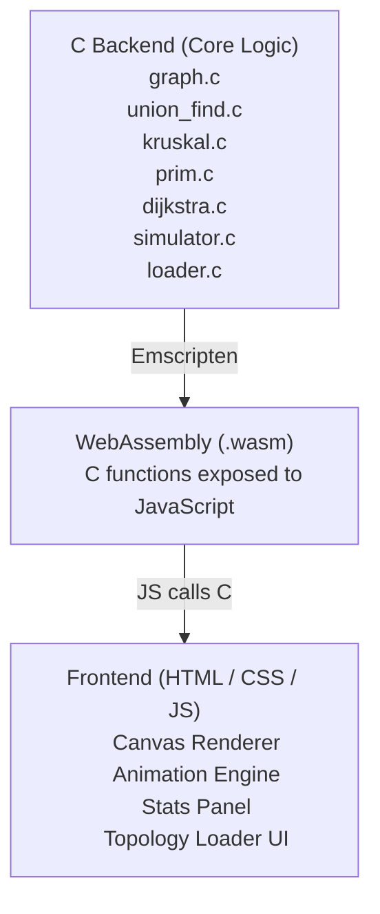

# 🌐 netroute-sim

> A network packet routing simulator built in C — visualizing Minimum Spanning Trees and shortest path algorithms through an animated, browser-based frontend.


---

## What is this?

**netroute-sim** is a college project that simulates how network packets are routed across a graph of routers and connections. It models real-world internet infrastructure concepts — finding the cheapest way to connect all routers (MST) and the fastest path to deliver a packet (shortest path).

All core algorithms are implemented in **pure C** and compiled to **WebAssembly**, powering a live animated frontend that visualizes both approaches side by side in real time.

---

## Features

- **Graph-based network modeling** — routers as nodes, connections as weighted edges
- **Kruskal's Algorithm** — builds MST by sorting and greedily picking cheapest edges
- **Prim's Algorithm** — builds MST by expanding from a starting node
- **Dijkstra's Algorithm** — finds the shortest/fastest packet delivery path
- **Union-Find (Disjoint Set)** — with path compression and union by rank
- **Packet Transmission Simulator** — simulate sending data from any router to any other
- **Topology File Loader** — load custom network graphs from `.txt` / `.csv` files
- **Side-by-side comparison** — MST cost vs Shortest Path, animated simultaneously
- **Browser-based visualization** — runs entirely in the browser via WebAssembly
- **Complexity Analyzer** — live display of time complexity for each algorithm run

---

## Architecture

---

## Project Structure [Intended]

```
netroute-sim/
│
├── src/                        # All C source files
│   ├── graph.c / graph.h       # Graph data structure (adjacency list)
│   ├── union_find.c / .h       # Disjoint Set with path compression
│   ├── kruskal.c / .h          # Kruskal's MST algorithm
│   ├── prim.c / .h             # Prim's MST algorithm
│   ├── dijkstra.c / .h         # Dijkstra's shortest path
│   ├── min_heap.c / .h         # Min-Heap / Priority Queue
│   ├── simulator.c / .h        # Packet transmission simulation
│   ├── loader.c / .h           # Load topology from file
│   └── main.c                  # CLI entry point + WASM export bridge
│
├── web/                        # Frontend
│   ├── index.html              # Main page
│   ├── style.css               # Styling
│   ├── visualizer.js           # Canvas animation engine
│   ├── wasm_bridge.js          # JS <-> WASM interface
│   └── netroute.wasm           # Compiled WebAssembly binary
│
├── topologies/                 # Sample network topology files
│   ├── small_network.txt       # 6-node test graph
│   ├── medium_network.txt      # 20-node graph
│   └── large_network.txt       # 100-node stress test
│
├── tests/                      # Unit tests for each module
│   ├── test_graph.c
│   ├── test_union_find.c
│   ├── test_kruskal.c
│   ├── test_prim.c
│   └── test_dijkstra.c
│
├── docs/                       # Documentation & report
│   ├── report.pdf
│   └── complexity_analysis.md
│
├── Makefile                    # Build system
└── README.md
```

---

## 🧠 Algorithms that will be Implemented

### Minimum Spanning Tree

| Algorithm | Strategy | Time Complexity | Space Complexity |
|-----------|----------|----------------|-----------------|
| Kruskal's | Sort edges, Union-Find to avoid cycles | O(E log E) | O(V + E) |
| Prim's    | Greedy expansion via Min-Heap | O(E log V) | O(V + E) |

### Shortest Path

| Algorithm | Strategy | Time Complexity | Space Complexity |
|-----------|----------|----------------|-----------------|
| Dijkstra's | Min-Heap based greedy relaxation | O((V + E) log V) | O(V) |

### Supporting Data Structures

| Structure | Used In | Key Operations |
|-----------|---------|----------------|
| Union-Find | Kruskal's | `find()` O(α(n)), `union()` O(α(n)) |
| Min-Heap | Prim's, Dijkstra's | `insert()` O(log n), `extract_min()` O(log n) |
| Adjacency List | All | `add_edge()` O(1), traversal O(V+E) |

---

## Topology File Format

Network graphs are loaded from plain text files in this format:

```
# netroute-sim topology file
# FORMAT: ROUTER_A ROUTER_B WEIGHT
NODES 6
EDGES 9
0 1 4
0 2 3
1 2 1
1 3 2
2 4 5
3 4 2
3 5 6
4 5 1
2 5 8
```

---

## Getting Started

### Prerequisites

- GCC (for running the CLI)
- Emscripten (`emcc`) — for compiling to WebAssembly
- A modern browser — for the frontend

### Running the CLI (Pure C)

```bash
# Clone the repo
git clone https://github.com/YOUR_USERNAME/netroute-sim.git
cd netroute-sim

# Build
make

# Run with a topology file
./netroute-sim topologies/small_network.txt

# Example output
./netroute-sim topologies/medium_network.txt --algo kruskal
./netroute-sim topologies/medium_network.txt --algo dijkstra --src 0 --dest 15
```

### Building WebAssembly

```bash
# Make sure Emscripten is installed and activated
source /path/to/emsdk/emsdk_env.sh

# Compile C to WASM
make wasm

# Serve the frontend locally
cd web/
python3 -m http.server 8080
# Open http://localhost:8080
```

---

## Live Demo [ To be hosted after frontend completion ]

> **[netroute-sim.github.io](https://YOUR_USERNAME.github.io/netroute-sim)** *(hosted on GitHub Pages)*

The live demo lets you:
- Load a preset network or upload your own topology file
- Watch **Kruskal's** and **Prim's** build the MST edge by edge, animated
- Simulate a packet delivery and watch **Dijkstra's** trace the shortest path
- Compare the total MST cost vs the shortest path cost in real time

---

## 📸 Screenshots

> *(Coming soon — will be added once the visualizer is complete)*

---

## Development Timeline

- [x] Project planning & architecture design
- [x] Graph data structure (`graph.c`)
- [x] Union-Find with path compression
- [x] Min-Heap / Priority Queue
- [x] Kruskal's Algorithm
- [x] Prim's Algorithm
- [x] Dijkstra's Algorithm
- [x] Packet Simulator
- [x] Topology File Loader
- [x] WASM bridge & Emscripten build
- [x] Frontend Canvas visualizer
- [x] Side-by-side animation comparison
- [x] Host on GitHub Pages

---

## Concepts Covered

- Weighted undirected graphs
- Greedy algorithms
- Minimum Spanning Trees
- Disjoint Set / Union-Find with path compression & union by rank
- Min-Heap (Priority Queue) from scratch in C
- Shortest path routing
- Dynamic memory management in C
- WebAssembly via Emscripten
- Real-time canvas-based animation

---

## Author

**Shaurya Dwivedi**
B.Tech ES | Indian Institute of Technology Jodhpur
[Github Profile](https://github.com/Shaurya-Dwivedi)


**Ankit Kumar Goyal**
B.Tech ME | Indian Institute of Technology Jodhpur
[Github Profile](https://github.com/ankit2006173)

**Harshal Joshi**
B.Tech CI | Indian Institute of Technology Jodhpur
[Github Profile](https://github.com/Harshal2108)

**Mridupawan Kalita**
B.Tech ES | Indian Institute of Technology Jodhpur
[Github Profile](https://github.com/MriduKalita23)

---

## License

This project is licensed under the MIT License. See [LICENSE](LICENSE) for details.

---

*Built as a college project exploring advanced graph algorithms and real-world network simulation.*
